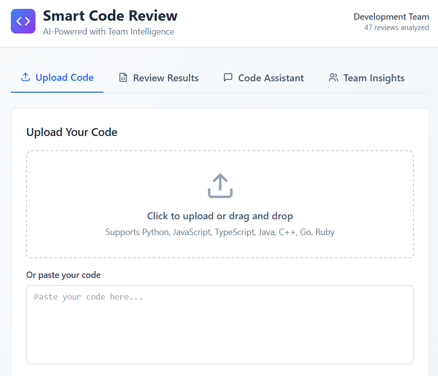
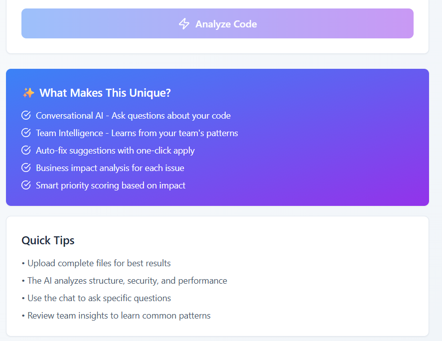
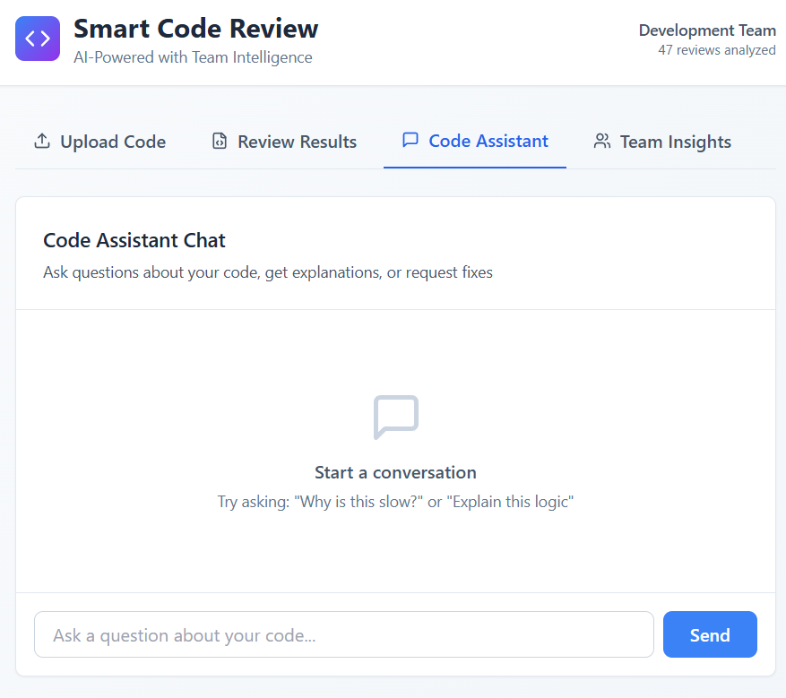
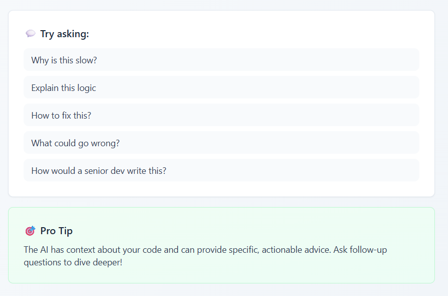

# Unthinkable-Project
🚀 Smart Code Review Assistant
An AI-powered code review tool that combines LLM intelligence with team-specific learning to provide actionable, context-aware code reviews.
✨ Unique Features
🎯 What Makes This Different

Conversational Code Understanding 💬

Chat with your codebase: "Why is this slow?"
Get ELI5 explanations of complex logic
Interactive Q&A during reviews

Team Intelligence Layer 🧠

Learns from your team's past reviews
Identifies team-specific patterns
Tracks common issues and improvements

Smart Priority & Impact Scoring 📊

Business impact analysis for each issue
Estimated fix time for every suggestion
Priority scoring based on user impact

Auto-Fix Automation ⚡

One-click fix suggestions
Generate complete refactored code
Auto-create PRs with improvements

📋 Table of Contents

Features
Installation
Usage
API Documentation
Architecture
Testing
Deployment
Contributing

🎯 Features
Core Functionality

✅ Multi-language support (Python, JavaScript, TypeScript, Java, C++, Go, Ruby, PHP)
✅ Automated code analysis for structure, readability, and best practices
✅ Security vulnerability detection
✅ Performance bottleneck identification
✅ Code complexity metrics
✅ Real-time chat interface for code questions

Advanced Features

🔥 Business Impact Analysis: Understand how each issue affects your users
🔥 Team Pattern Recognition: Learn from your team's coding style
🔥 Auto-fix Suggestions: Get working code fixes, not just descriptions
🔥 Priority Scoring: Focus on what matters most
🔥 Historical Tracking: See improvement trends over time

🛠️ Installation
Prerequisites

Python 3.9+
Node.js 16+ (for frontend)
PostgreSQL (optional, SQLite works for development)
OpenAI API key or alternative LLM provider

